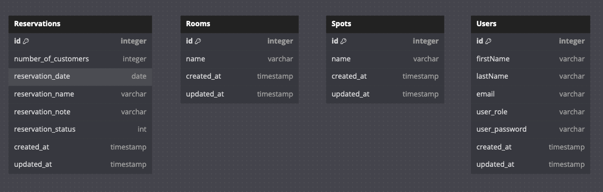

# Schema DB

<!-- TOC -->
* [Schema DB](#schema-db)
  * [Ce que l'on souhaite](#ce-que-lon-souhaite)
    * [Table Membership](#table-membership)
    * [Les spots désignent des tables du restaurant.](#les-spots-désignent-des-tables-du-restaurant)
  * [Relations : One To One](#relations--one-to-one)
  * [Relations : One To Many](#relations--one-to-many)
  * [Relations : Many To Many](#relations--many-to-many)
  * [Ajouter Membership](#ajouter-membership)
<!-- TOC -->

## DBdiagram.io

Faire des schémas :

- https://dbdiagram.io/d

### DBML

```md
Table Reservations {
  id integer [primary key]
  number_of_customers integer
  reservation_date date
  reservation_name varchar
  reservation_note varchar
  reservation_status int
  created_at timestamp 
  updated_at timestamp 
}

Table Rooms {
  id integer [primary key]
  name varchar
  created_at timestamp
  updated_at timestamp
}

Table Spots {
  id integer [primary key]
  name varchar
  created_at timestamp
  updated_at timestamp
}

Table Users {
  id integer [primary key]
  firstName varchar
  lastName varchar
  email varchar
  user_role varchar
  user_password varchar
  created_at timestamp
  updated_at timestamp
}
```

### Capture d'ecran des tables



## Ce que l'on souhaite

- Un utilisateur peut avoir plusieurs réservations
- Une reservation a un spot et un spot a plusieurs reservations
- Un spot a une room et une room a plusieurs spots
- Un utilisateur a un role, avec une table de roles

Nous allons effectuer deux changements

### Table Membership

Chaque utilisateur peut être membre de l'établissement afin de bénéficier d'avantages

```md
Table Memberships {
  id integer [primary key]
  membership_name varchar
  number_of_reservation int
  expiration_date date
  created_at timestamp
  updated_at timestamp
}
```

### Les spots désignent des tables du restaurant.

Chaque reservation est liée à un spot, qui est une table du restaurant.
Un spot a plusieurs reservations.
Chaque reservation peut avoir plusieurs spots, par exemple pour des reservations de plusieurs tables.

## Relations : One To One

User <-> Membership

## Relations : One To Many

Room -> Spot


## Relations : Many To Many

Spot <-> Reservation

## Ajouter Membership

```js
// model/membership.js

module.exports = (sequelize, DataTypes) => {
    const Membership = sequelize.define('Membership', {
        id: {
            type: DataTypes.INTEGER,
            primaryKey: true,
            autoIncrement: true
        },
        membership_name: {
            type: DataTypes.STRING,
            allowNull: false
        },
        number_of_reservations: {
            type: DataTypes.INTEGER,
            defaultValue: 0
        },
        expiration_date: {
            type: DataTypes.DATEONLY,
            allowNull: false
        },
    }, {
        // Les options
        tableName: 'Memberships',
        timestamps: true, // Sequelize utilise `createdAt` et `updatedAt` par défaut
    });

    return Membership;
};

```

```bash
npx sequelize migration:generate --name create-membership
npx sequelize db:migrate 
```

```js
//migration/XXXXXXXXX-create-membership.js

'use strict';

module.exports = {
  async up(queryInterface, Sequelize) {
    await queryInterface.createTable('Memberships', {
      id: {
        allowNull: false,
        autoIncrement: true,
        primaryKey: true,
        type: Sequelize.INTEGER
      },
      membership_name: {
        type: Sequelize.STRING,
        allowNull: false
      },
      number_of_reservations: {
        type: Sequelize.INTEGER,
        defaultValue: 0
      },
      expiration_date: {
        type: Sequelize.DATEONLY,
        allowNull: false
      },
      created_at: {
        allowNull: false,
        type: Sequelize.DATE,
        defaultValue: Sequelize.literal('CURRENT_TIMESTAMP')
      },
      updated_at: {
        allowNull: false,
        type: Sequelize.DATE,
      }
    });
  },

  async down(queryInterface, Sequelize) {
    await queryInterface.dropTable('Memberships');
  }
};

```